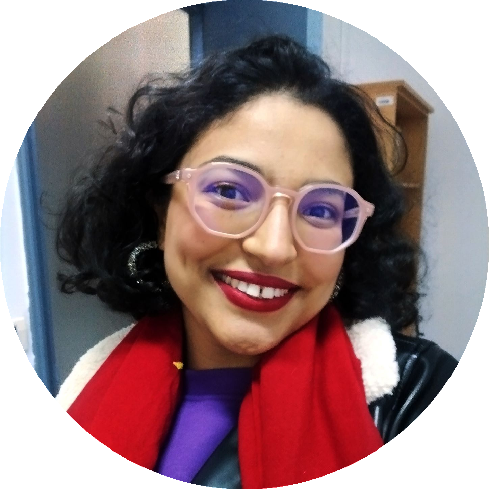

</img>
<h1 style="text-align: center;">Bio</h1>
I am an agronomic engineer specialized in fisheries management and fueled by my passion for understanding the nuances of the interface of sustainability, food security, ecology and global health. I consider myself a life-long learner eager to both build on my academic foundations in agronomy and fisheries and stay in tune with the information processing techniques and modelling.

Currently I'm fulfilling a PhD in complex systems at the french Research & development Institute (IRD) within the *"Unit of  Mathematical  & Computational  Modeling  of Complex Systems  (UMMISCO)"*, and the Pasteur Institute of Tunis within the *"Bio Informatics, Bio Mathematics, Bio-Statistics Laboratory"*.

