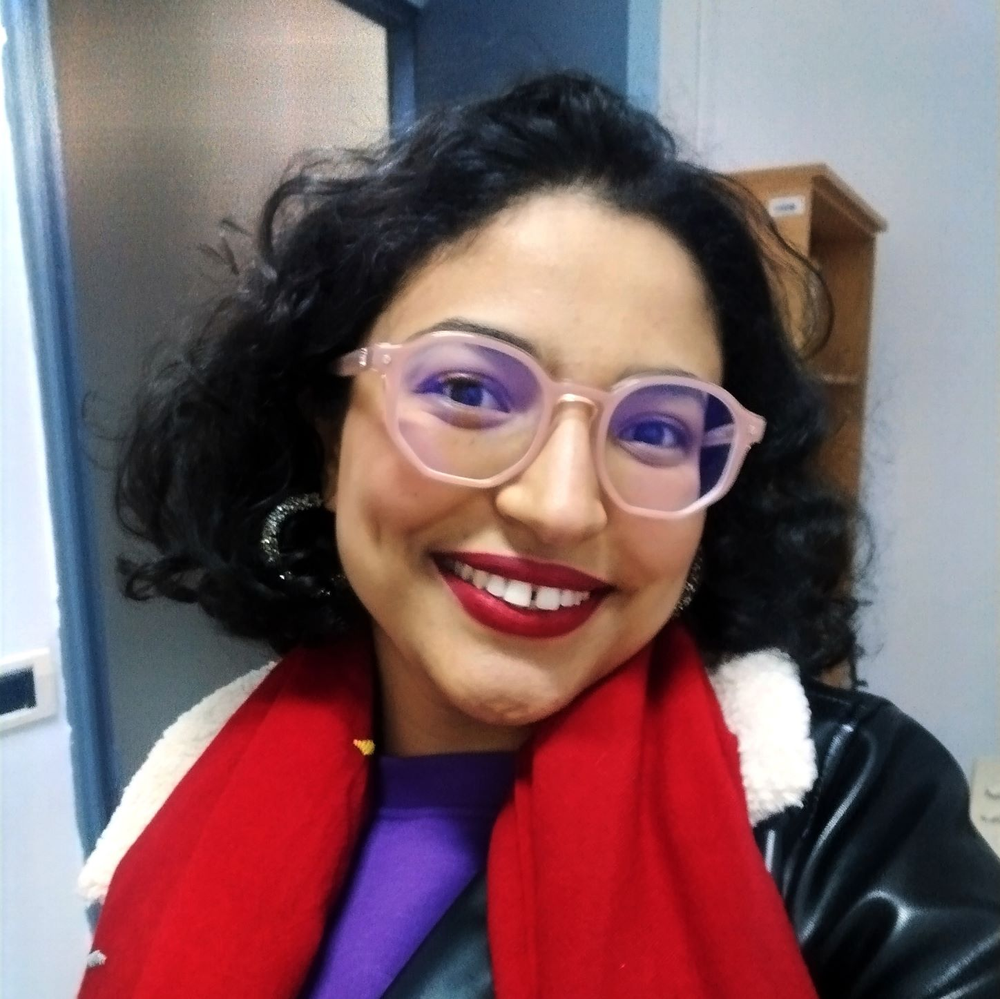

## Bio 

Cyrine Chenaoui is an agronomic engineer and a fisheries manager  based in Tunis,Tunisia. 

Fueled by my passion for understanding the nuances of the interface of sustainability, food security, ecology and global health, I consider myself alife-long learner eager to both build on my academic foundations in agronomy and fisheries and stay in tune with the information processing techniques and modelling.
